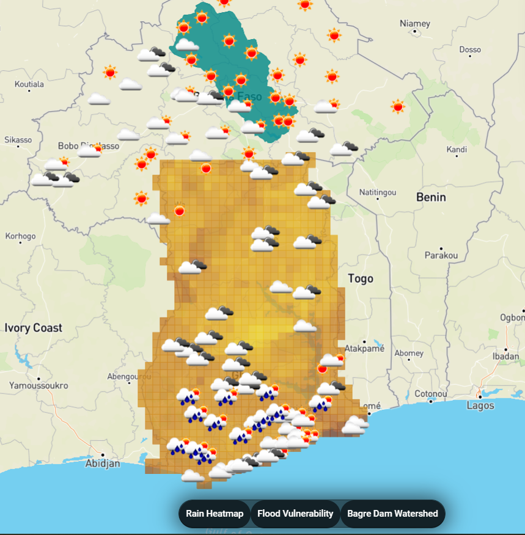
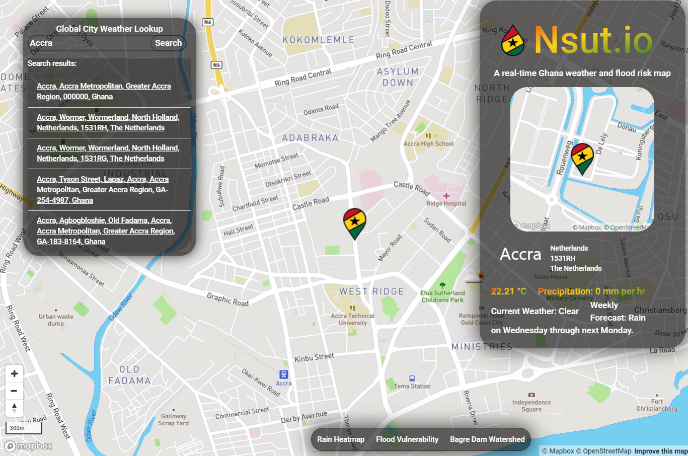

# Ghana Weather App - Nsut.io

This is a fullstack application that provides real time weather mapping in Ghana in the context of flood risk. This app was ideated by Anthony Ayebiahwe from the UPenn School of Design as a potential product to alert Ghanaians of high flood risk in their area. Contextual research on flooding in Ghana was provided by Steven Chang from the School of Design. 

I designed this application around map usability. It uses the Mapbox GL library and provides on-demand weather data using the Nominatim reverse geocoder when clicking on the map. The map layers include live weather data from OpenWeatherMap at specific cities, precipitation interpolated across Ghana, and a surface clay percentage as a potential metric for soil permeability/flood vulnerability.

This application also shows the volume of rainfall that collects in the watershed to the Bagre Dam, releases from which are linked to flooding in Northern Ghana.

I developed this application for my Javascript course in Spring 2019 and as my capstone project for the Masters of Science in Applied Geosciences at UPenn.

The app can be viewed at http://leoshaw.pythonanywhere.com/. It may take some time to load when accessing for the first time.

This application uses a Flask backend and can be deployed by typing the following commands into your bash terminal:

```
git clone this repository onto your local machine

cd into the repository

python3 -m venv venv

. venv/bin/activate

pip install flask

pip install flask-cors

pip install requests

pip install schedule

export FLASK_APP=serve.py

python -m flask run
```

*This application uses hard coded API keys and thus certain layers will not load if the Flask server is running on multiple local machines.*
*Certain layers and DOM elements are dependent on the websites OpenWeatherMap, DarkSky, and Nominatim being up.*

Here are some screenshots of the app in action:

 

